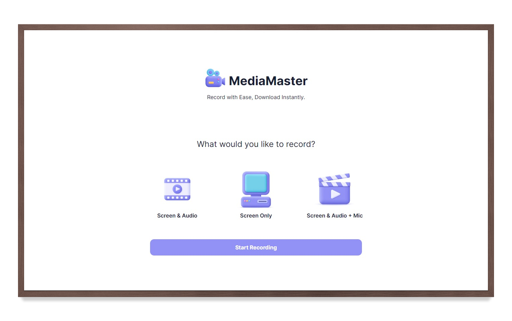

# 🎬 MediaMaster



## 📝 Description

MediaMaster is a versatile media recording application that allows users to capture screen activity, audio input, and more. Whether you're recording presentations, tutorials, or gameplay, MediaMaster provides intuitive features for seamless recording

## 🔮 Features

-   🖥️ Screen recording with options:
    -   🖥️ Screen only
    -   🔊 Screen with system audio
    -   🎙️ Screen with system audio + microphone
-   📺 Live preview of recordings
-   ⏯️ Easy-to-use interface for recording controls, including pause and resume
-   🛠️ Simple installation process
-   🌐 Cross-platform compatibility

## 🚀 Live Preview

You can view the live preview of the project [here](https://media-master.vercel.app).

## 💻 Technologies Used

-   Next.js
-   Tailwind CSS
-   MediaStream API

## ⚙️ Installation

1. Clone the repository:
    ```bash
    git clone https://github.com/<your_username>/MediaMaster.git
    ```
2. Navigate to the project directory:
    ```bash
    cd MediaMaster
    ```
3. Install dependencies:
    ```bash
    npm install
    ```
4. Start the application:
    ```
    npm run dev
    ```
5. Open the application in your browser:
    ```
    http://localhost:3000
    ```

## 🌟 Support Us

If you find this helpful or valuable, please consider 🌟 starring the repository. It helps us gain visibility and encourages further development. We appreciate your support!

## 🤝 Contributing

Contributions are most welcomed! If you find any bugs or issues in the project, please report them in the issues section of the repository. If you'd like to add new features or enhance existing ones, feel free to submit a pull request.

## 📄 License

This project is licensed under the [MIT License](LICENSE).

## 🤝 Acknowledgements

This project was inspired by an older repository built with traditional web technologies (Pug, CSS, JavaScript). While the repository served as inspiration, this project has been rebuilt from scratch using modern technologies, including Next.js, React.js, and Tailwind CSS.

## 🤝 Acknowledgements

This project was inspired by an repository named [screenREC](https://github.com/heysagnik/screenREC) built with traditional web technologies (Pug, CSS, JavaScript). While the old repository served as inspiration, this project has been rebuilt from scratch using modern technologies, including Next.js, React.js, and Tailwind CSS.

## 📧 Contact Information

For questions or inquiries, please contact [Sahil Atahar](mailto:sahilatahar@gmail.com).
